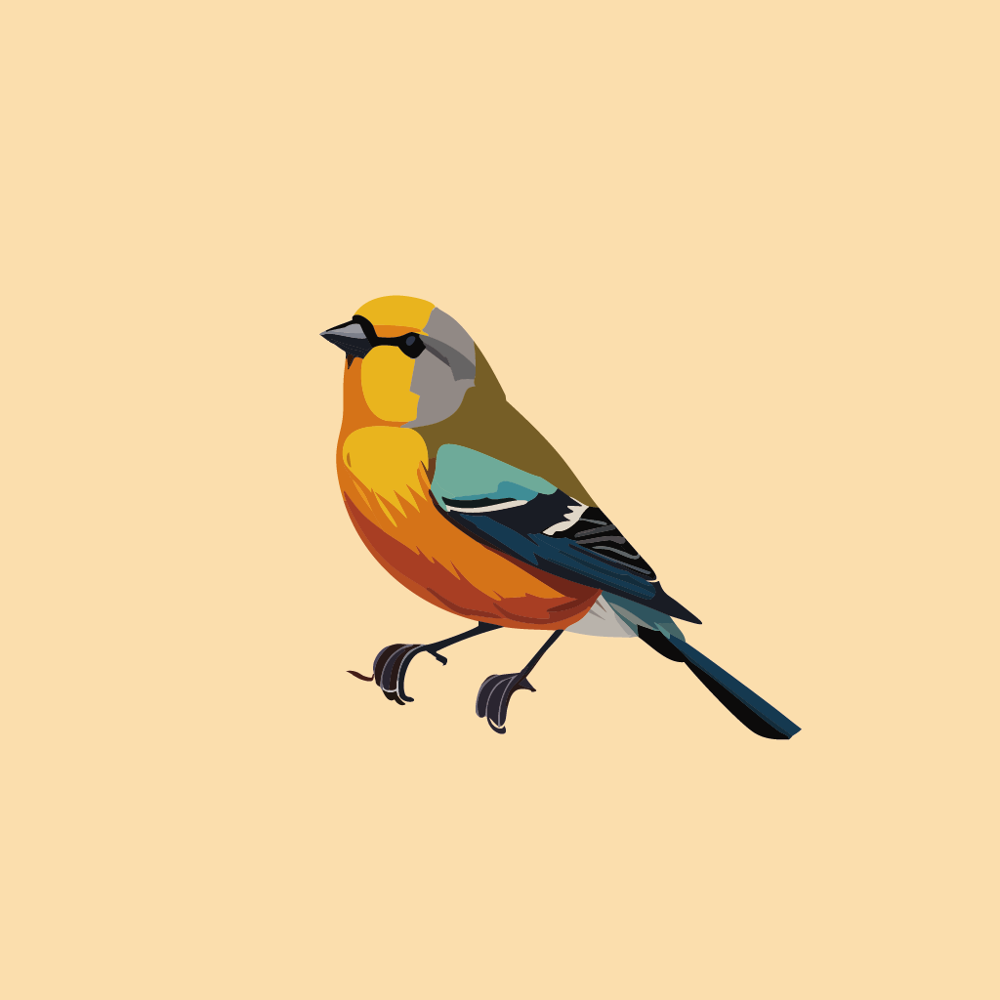

  

<h1 align="center">
zuk246`s portfolio
</h1>

## About

This is zuk246`s portfolio.
Please click [this URL](https://zuk246.github.io/portfolio/).

## Author

[zuk246](https://github.com/zuk246)
